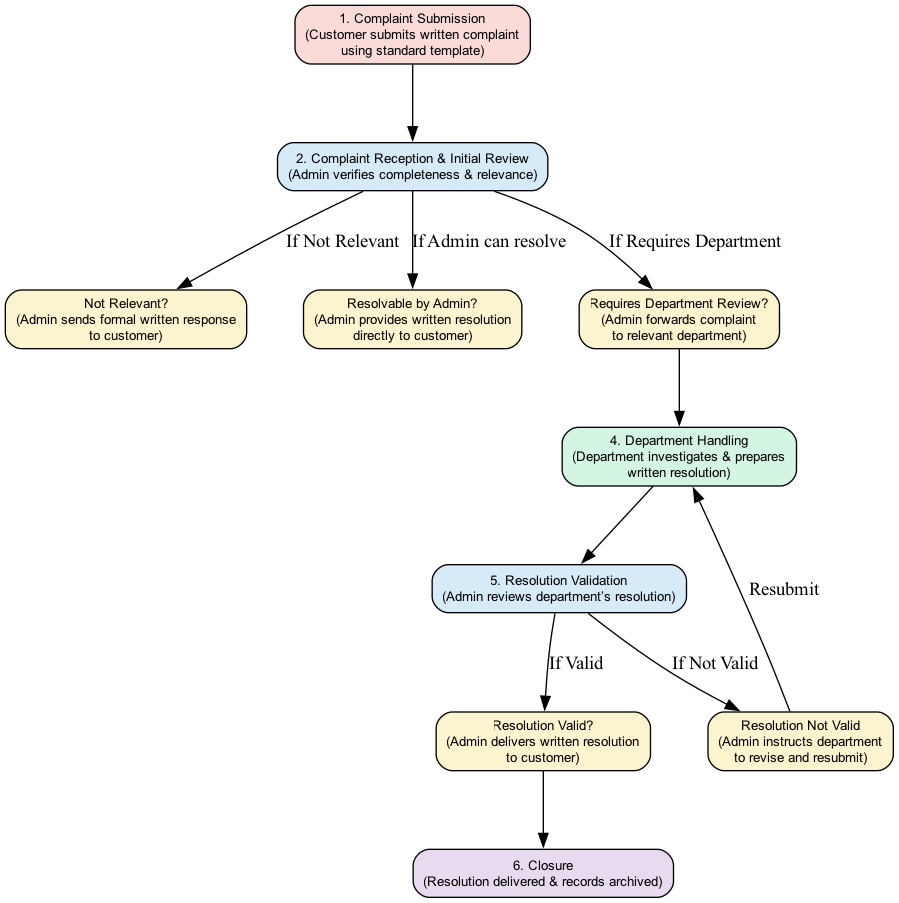
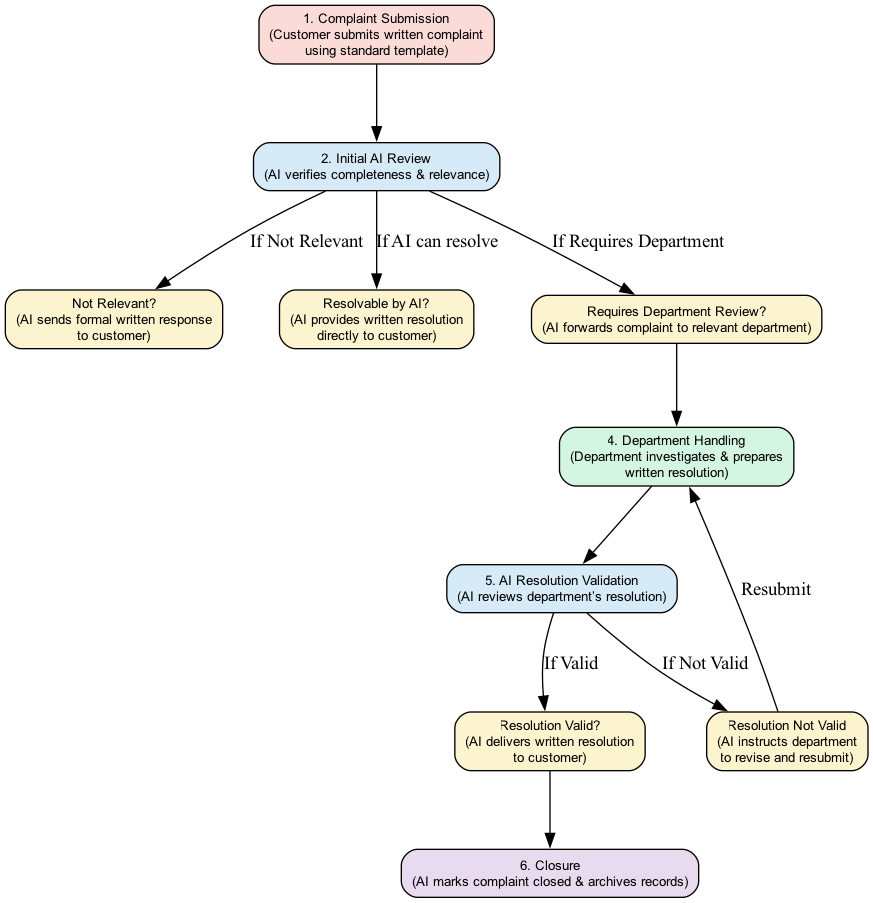

# Project blueprint — folder structure + step-by-step implementation plan

1. a **recommended monorepo folder structure** (tree + file descriptions)
2. **phase-by-phase implementation steps** (what to build in what order)
3. **key code snippets / config examples** you can paste and adapt (LangChain, LangGraph, SQL, vector indexing, notification hooks, prompt templates)
4. **testing / deployment / operational** checklist.

---

# 1) System Workflow


A. Old System Workflow




B. Agentic AI -- System Workflow



C. Data base design


---

# 2) Phase-by-phase implementation plan (step-by-step)

Build progressively. Each phase has focused deliverables so you can ship an MVP fast.

### Phase 0 — repo & infra prep (very first)

1. Initialize repo, add `.env.example` with required env vars (DB, OpenAI key, Fiazz API key, SMTP/Twilio keys).
2. Create Dockerfiles and `docker-compose.yml` to run PostgreSQL, Redis, vector DB local (or mock), API, worker.
3. Set up PostgreSQL and Alembic migrations. Add base models for `Customer`, `Complaint`, `Resolution`, `CommunicationLog`.
4. Minimal FastAPI app exposing `POST /complaints` (store complaint in SQL) and `GET /complaints/{id}`.

Deliverable: Able to store complaints in SQL and retrieve them.

---

### Phase 1 — Vector DB + KB ingestion & embeddings

1. Create `scripts/seed_kb.py` to:
   * read policy docs / FAQs (PDFs, md, docs)
   * split into snippets
   * create embeddings (using OpenAI embeddings or local)
   * upload snippets + metadata to Fiazz vector DB
2. Implement a vector retriever wrapper in `ai-orchestration/tools/vector_tool.py` (abstract client so swapping providers is easy).
3. Add a simple endpoint `POST /kb/index` to reindex KB.

Deliverable: searchable KB in vector DB.

---

### Phase 2 — LangChain tools & SQL agent

1. Implement SQL toolkit wrapper using LangChain’s SQL toolkit or custom wrapper:
   * a safe SQL agent that only runs parameterized queries and logs them.
   * helper functions: `get_customer_history(customer_id)`, `get_complaint(id)`.
2. Implement `ai-orchestration/tools/sql_tool.py` exposing safe read/write methods (no arbitrary queries).
3. Create prompt templates to instruct LLM how to use SQL results + KB snippets (store prompts in `prompts/`).
4. Add unit tests for SQL tool.

Deliverable: Tools to read/write structured state for LLM.

---

### Phase 3 — LangGraph workflow & LLM integration

1. Install LangGraph and define the workflow graph in `workflows/graph.py` (nodes = functions that call tools).
2. Implement core nodes:
   * `ingestion_node` — saves complaint (SQL) and indexes text in vector DB.
   * `relevance_node` — retriever + LLM to decide relevance (returns JSON: decision, score, category).
   * `decision_node` — routes to auto-resolve (LLM template) or `dept_queue`.
   * `validation_node` — uses scoring rubric (0–5) to validate dept resolution.
   * `communication_node` — enqueues notification tasks to worker.
3. For each node: add structured input & output schemas (helps auditing).
4. Wire the LangGraph runner to the API (e.g., FastAPI calls graph.run(complaint_id)).

Deliverable: Orchestrated automated flow that can triage and route complaints.

---

### Phase 4 — Auto-resolve, Dept UI, and validation loop

1. Implement auto-resolution for simple cases:
   * Refunds, password resets, plan changes — implement action executor service with idempotent ops.
   * Log actions in SQL.
2. Create department portal (React) to show assigned complaints, KB snippets, and allow resolution submission.
3. Implement validation node (scoring rubric) using LangChain + RAG:
   * pull resolution & complaint from SQL
   * retrieve policy snippets from vector DB
   * call LLM to return `{scores, average, status, feedback}`
4. Add feedback loop: if `Invalid`, show feedback to dept UI; allow resubmit.

Deliverable: Human-in-the-loop and AI validation working end-to-end.

---

### Phase 5 — Notifications, retries, observability

1. Implement `worker/tasks/notifications.py` using Celery:
   * Email via SendGrid/AWS SES with templates (both text and HTML).
   * SMS via Twilio with short templates.
   * Persist delivery attempts to `communication_log` table.
   * Retry with exponential backoff; poison queue handling.
2. Add audit logs (store LLM prompts, responses, model version, KB snapshot id).
3. Add metrics (Prometheus client) — measure triage latency, validation accept rate, notification delivery rate.
4. Add Sentry for errors, and a basic runbook.

Deliverable: Reliable communication layer with monitoring and auditability.

---

### Phase 6 — Security, testing, and deployment

1. Add PII redaction before sending to external LLMs or set up private LLM.
2. Harden auth (Keycloak/Auth0) for APIs and web UI.
3. Full test coverage: unit, integration (fake LLM), e2e tests (simulate complaint→resolution).
4. CI/CD pipeline: run tests, build containers, deploy to k8s.
5. Post-deploy: run canary for auto-resolve rules.

Deliverable: Production-ready system.

---

# 3) Key config / code snippets (copy/paste starters)

### .env.example

```
# Database
DATABASE_URL=postgresql+psycopg2://user:pass@db:5432/complaints

# Redis (Celery)
REDIS_URL=redis://redis:6379/0

# LLM / Embeddings
OPENAI_API_KEY=sk-...
OPENAI_MODEL=gpt-4o

# Vector DB (Fiazz)
FIAZZ_API_KEY=fi_...

# Mail & SMS
SMTP_HOST=smtp.sendgrid.net
SMTP_USER=apikey
SMTP_PASS=sg_api_key
TWILIO_ACCOUNT_SID=ACxxxxx
TWILIO_AUTH_TOKEN=xxxx
TWILIO_FROM=+1234567890

# App
SECRET_KEY=xxx
```

---

### SQLAlchemy models (services/api/src/app/models/complaint.py)

```python
from sqlalchemy import Column, String, Integer, Text, DateTime, Enum, JSON, func
from sqlalchemy.dialects.postgresql import UUID
import uuid
from .base import Base

class Complaint(Base):
    __tablename__ = "complaints"
    id = Column(UUID(as_uuid=True), primary_key=True, default=uuid.uuid4)
    customer_id = Column(String, nullable=True)
    channel = Column(String, nullable=False)
    raw_text = Column(Text, nullable=False)
    normalized_text = Column(Text)
    status = Column(String, default="new", index=True)
    assigned_department = Column(String, nullable=True)
    metadata = Column(JSON, default={})
    created_at = Column(DateTime(timezone=True), server_default=func.now())
```

---

### Vector indexing script (scripts/seed_kb.py) — pseudocode

```python
from embeddings import get_embedding
from fiazz import FiazzClient  # replace with your lib

client = FiazzClient(api_key="...")
kb_texts = load_policy_docs("policies/")

for doc in kb_texts:
    chunks = split_text(doc, chunk_size=800, overlap=100)
    for i, chunk in enumerate(chunks):
        emb = get_embedding(chunk)
        client.upsert(doc_id=f"{doc_id}-{i}", vector=emb, metadata={"source": doc.source, "text": chunk})
```

---

### LangChain SQL tool bootstrap (ai-orchestration/tools/sql_tool.py)

```python
from langchain_community import SQLDatabase
from langchain_community.sql_database import SQLDatabaseToolkit

db = SQLDatabase.from_uri(os.getenv("DATABASE_URL"))
toolkit = SQLDatabaseToolkit(db=db)

# expose safe methods
def get_complaint(complaint_id: str):
    return db.run(f"SELECT * FROM complaints WHERE id = '{complaint_id}'")
```

*(For safety use parameterized queries and never allow raw SQL from LLM.)*

---

### LangGraph node example (ai-orchestration/workflows/nodes/relevance_node.py) — skeleton

```python
def relevance_node(context):
    complaint_id = context["complaint_id"]
    complaint = sql_tool.get_complaint(complaint_id)
    kb_snippets = vector_tool.retrieve(complaint["normalized_text"], top_k=5)

    prompt = prompts.relevance_prompt.format(
        complaint=complaint["normalized_text"],
        kb_snippets="\n\n".join([s["text"] for s in kb_snippets])
    )
    llm_response = llm.chat(prompt)
    result = parse_json(llm_response)  # expect decision, score, category
    sql_tool.update_complaint(complaint_id, {"status": "triaged", "metadata": {"relevance": result}})
    return result
```

---

### Validation scoring prompt (prompts/validation.txt)

```
You are a complaint resolution validator. Input:
- Complaint: {complaint}
- Resolution: {resolution}
- Policies: {policy_snippets}

Using the 0-5 rubric (relevance, completeness, compliance, clarity, actionability),
return JSON:
{
  "scores": {"relevance": int, "completeness": int, "compliance": int, "clarity": int, "actionability": int},
  "average": float,
  "status": "Valid|Needs Review|Invalid",
  "short_feedback": "..."
}
```

---

# 4) Notification worker (concept) & persistence

* Worker receives message payload `{complaint_id, channel, template_id, payload}`.
* Worker renders template, sends email/SMS, writes `communication_log` entry:
  * `{id, complaint_id, channel, to, body, provider_message_id, status, attempt_count, last_attempted_at}`
* On failure: retry with exponential backoff; after N attempts, mark as `failed` and create alert for manual follow-up.

---

# 5) Tests & QA

* Unit: test tools (SQL wrapper, vector retriever, prompt templates).
* Integration: run LangGraph workflow with a *fake LLM* (returning canned decisions).
* E2E: use local docker-compose (Postgres, Redis, mock vector DB) to create complaint → route → dept → validate → notify.
* Adversarial: ambiguous complaints and PII heavy inputs.

---

# 6) Monitoring, logging, and governance

* **Observability** : Prometheus+Grafana for metrics (triage latency, validation accept rate, notification success).
* **Logging** : Structured JSON logs (ELK / OpenSearch).
* **Audit trail** : store prompts, model version, KB snapshot id, and final resolution in `audit` table or S3 (immutable).
* **Model governance** : Add a config table that stores allowed auto-resolve actions & thresholds (avoid accidental refunds).

---

# 7) Helpful tips / gotchas

* **Never** send raw customer PII to 3rd-party LLMs unless you have proper contract and encryption; implement PII redaction or use private LLM.
* **Idempotency** for action executor (refunds, account changes). Use transaction logs and external provider ids.
* **Ground every decision** : always include the top-K KB snippets used by LLM in the audit record.
* Keep prompts in files (not inline) for easy iteration and version control.

---

# 8) Next concrete offers (I can produce immediately)

Pick any and I’ll produce it now (no waiting):

* a) A **complete OpenAPI spec** for the API endpoints.
* b) A **LangGraph workflow file** (full Python implementation with nodes wired to placeholders).
* c) `scripts/seed_kb.py` ready-to-run (with Fiazz client placeholders).
* d) A **React department UI skeleton** (single-file, production-ready).
* e) `docker-compose.yml` for local dev with Postgres, Redis, and mock vector DB.
